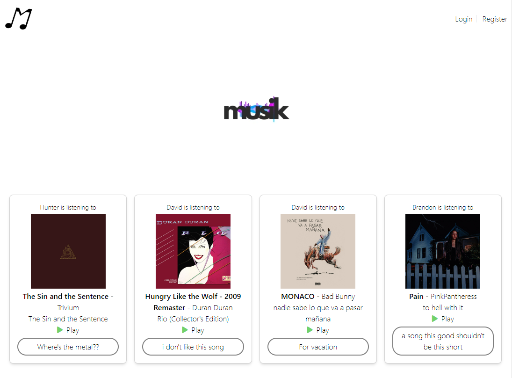
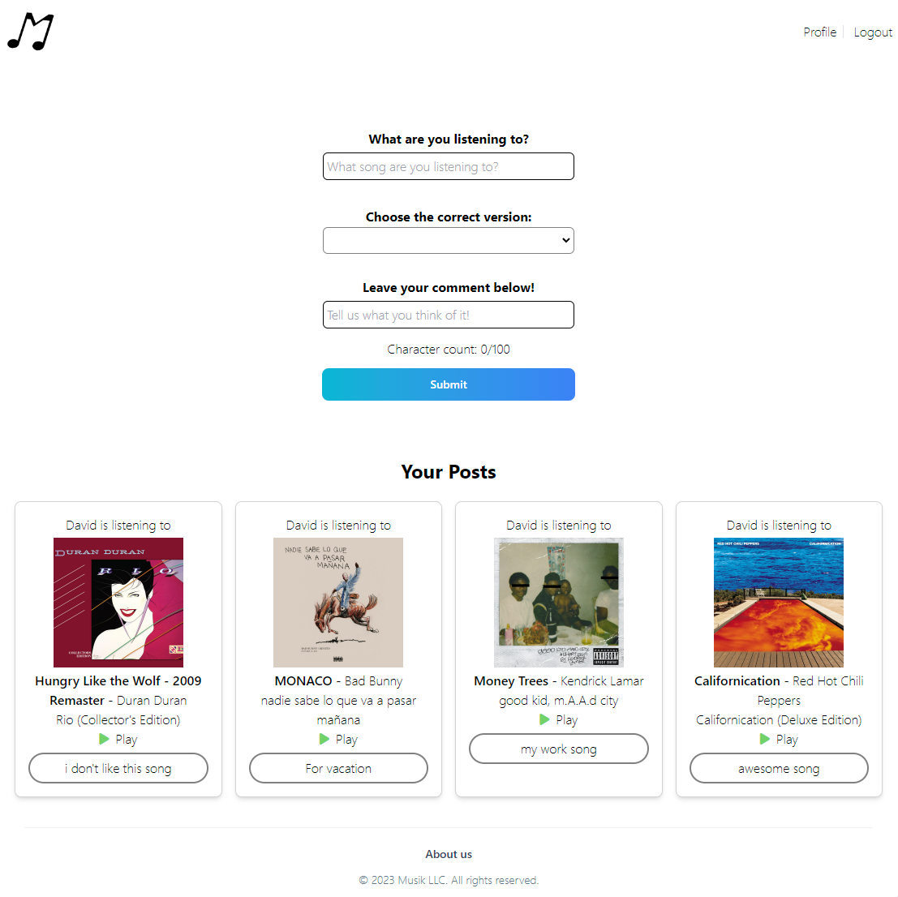

# _small.png) Musik

## Description

The Musik app is a project to connect users who will be able to share songs and posts with each other. We want to create a community of music lovers who have similar interests.
As fellow music lovers we want to have create a place just for music. This project was built to have like minded individuals to come together and create a community.
Musik brings users to meet and post about music others are listening to. We learned how to make a social media hub for only music lovers.

### Link to deployed app

>[Musik](https://arcane-refuge-32686-92d3868f1b08.herokuapp.com/)

## Table of Contents

- [Description](#description)
- [Usage](#usage)
- [Credits](#credits)
- [License](#license)
- [Contribute](#contribute)

## Usage

### When you first enter the home page press on the register button to sign up

### In the sign up page enter your email, username and password and press sign up

### In your profile page you can post what you are listening to. First, type the song name in the top box. After that choose the version of your song. Then leave your comments (optional) other users will see and finally press submit

### Your song will be posted on your profile and the home page

## Credits

- Hunter Muratore (<https://github.com/HunterMuratore>)
- Brandon Myers (<https://github.com/brandonom>)
- Alex Pohlman (<https://github.com/apohl53>)
- Kevin Castro (<https://github.com/Kev-Castro>)
- David Duran (<https://github.com/ddurandev>)

## License

Please refer to the LICENSE in the repo.

## Badges

## Contribute

Musik is an open source project that welcomes any passionate developers and music fans to contribute their ideas and time to enhance the app.

Feel free to fork this repo and work on your own, or send us a message here to ask any questions about the app or how to contribute!
>Email: [muratoreh@gmail.com](mailto:muratoreh@gmail.com)
