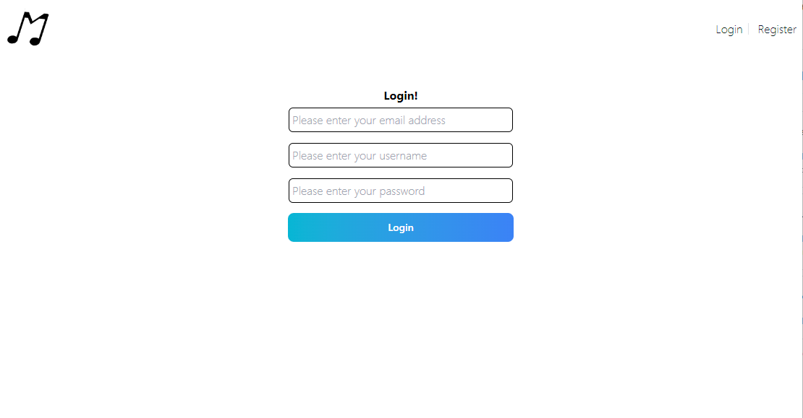

# _small.png) Musik

## Description

The Musik app is a project to connect users who will be able to share songs and posts with each other. We want to create a community of music lovers who have similar interests.
As fellow music lovers we want to have create a place just for music. This project was built to have like minded individuals to come together and create a community.
Musik brings users to meet and post about music others are listening to. We learned how to make a social media hub for only music lovers.

## Table of Contents

- [Installation](#installation)
- [Usage](#usage)
- [Credits](#credits)
- [License](#license)

## Installation

N/A

## Usage

When you first enter the home page press on the register button to sign up.

In the sign up page enter your email, usernamen and password and press sign up.

Once you sign up, press the login button on the nav and fill in your Email, username, and password then press login.

## Credits

- Hunter Muratore (https://github.com/HunterMuratore) 
- Brandon Myers (https://github.com/brandonom) 
- Alex Pohlman (https://github.com/apohl53)  
- Kevin Castro (https://github.com/Kev-Castro) 
- David Duran (https://github.com/ddurandev) 

## License

Please refer to the LICENSE in the repo.

## Badges

## Features

N/A

## How to Contribute

N/A

## Tests

N/A